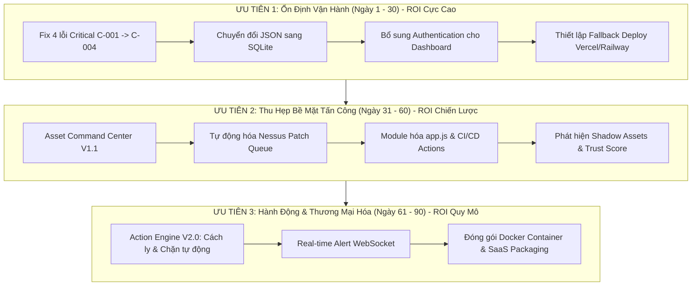

# SENTINELOPS - BÁO CÁO TÓM TẮT ĐIỀU HÀNH (EXECUTIVE SUMMARY)

**Ngày lập báo cáo:** 08/09/2026  
**Đơn vị thực hiện:** Ban Điều Hành Kỹ Thuật (CTO & Chief Architect)  
**Phạm vi tổng hợp:** Dựa trên 4 tài liệu chiến lược:
1. `CTO_AUDIT.md` (Báo cáo audit của CTO & Kiến trúc sư trưởng)
2. `TECHNICAL_DEBT_REGISTER.md` (Phiếu theo dõi nợ kỹ thuật)
3. `SECURITY_REVIEW.md` (Đánh giá an ninh hệ thống)
4. `NEXT_90_DAYS_ROADMAP.md` (Lộ trình phát triển 90 ngày)

---

## 1. ĐIỂM TỔNG THỂ DỰ ÁN

* **Điểm đánh giá tổng thể:** **6.5 / 10**
* **Hiện trạng hoạt động:** 
  * 🟢 **Phần lõi (Core Engine):** Hoạt động mạnh mẽ, thu thập và phân tích dữ liệu chuyên sâu.
  * 🔴 **Phân phối & Hiển thị (UI/Deployment):** Đang bị nghẽn nghiêm trọng (lỗi render giao diện C-001 đến C-004 và lỗi tự động triển khai trên Render.com).
* **Đặc trưng kiến trúc:** Hiện tượng *"Đầu to mình teo"* — Khả năng thu thập, phân tích rủi ro của hệ thống Python backend rất xuất sắc, nhưng tầng lưu trữ dữ liệu (JSON tĩnh) và tầng hiển thị (Vanilla JS) còn mỏng manh, dễ vỡ.

### Bảng điểm độ trưởng thành từng phân hệ (Maturity Score)

| Phân hệ / Thành phần | Điểm số (0-10) | Đánh giá hiện trạng |
|---|:---:|---|
| **Domain Intelligence** | **9.0** | Hoàn thiện nhất; thực thi nghiêm ngặt DNSSEC, DMARC, SPF, Domain Lock. |
| **Nessus Integration** | **8.5** | Thu thập dữ liệu lỗ hổng chi tiết, phân loại tự động chuẩn xác. |
| **MCP Platform** | **8.0** | Thư viện hơn 90 công cụ an ninh là tài sản cốt lõi giá trị cao. |
| **WAAP Integration** | **7.5** | Kết nối VNPT WAAP ổn định, theo dõi chứng chỉ SSL/TLS và ứng dụng web tốt. |
| **DFIR / Threat Hunting** | **7.5** | Kịch bản săn tìm mối đe dọa (Lateral Movement, Credential Dumping) chuyên nghiệp. |
| **Asset Intelligence** | **6.5** | Độ bao phủ rộng nhưng tỷ lệ tài sản chưa định danh (Unknown Assets) còn cao (14/24). |
| **Reporting Engine** | **5.0** | Scorecard còn cứng nhắc, dễ phát sinh lỗi logic hiển thị. |
| **Dashboard UI** | **4.0** | Cấu trúc Monolithic Vanilla JS khó bảo trì, lỗi render nghiêm trọng. |

---

## 2. TOP 10 ĐIỂM MẠNH (STRENGTHS)

1. **Intelligence Pipeline chuyên sâu:** Hệ thống Python scripts thu thập dữ liệu cực kỳ chi tiết, vận hành độc lập và ổn định.
2. **Risk Engine khoa học:** Logic tính toán điểm rủi ro an ninh (74/100) có cơ sở vững chắc, phân cấp độ ưu tiên rõ ràng.
3. **Asset Aging Engine tự động:** Tự động theo dõi vòng đời thiết bị, giải quyết triệt để rủi ro từ các "tài sản ma" (zombie assets).
4. **Kiến trúc Module hóa của MCP:** Thư viện 90+ công cụ an ninh thiết kế dạng module, dễ dàng mở rộng và tích hợp thêm công cụ mới.
5. **Hardening hạ tầng Domain vững chắc:** Thiết lập chuẩn mực an ninh cao cấp cho tên miền: DNSSEC, DMARC, SPF, WHOIS Privacy, Domain Lock.
6. **Quy trình tự động hóa Collectors:** Bộ điều phối `run_collectors.py` giảm thiểu tối đa công việc vận hành thủ công.
7. **Cấu trúc dữ liệu chuẩn hóa:** Mô hình dữ liệu an ninh tiệm cận các bộ tiêu chuẩn quốc tế như NIST và ISO 27001.
8. **Hệ thống tài liệu dự án bài bản:** Hồ sơ kỹ thuật tại `docs/project` đầy đủ ngữ cảnh, phục vụ tốt cho việc chuyển giao và phát triển.
9. **Độ phủ Telemetry toàn diện:** Giám sát đa tầng từ mức Host, Process, Endpoint cục bộ đến Cloud WAAP.
10. **Chi phí vận hành ban đầu tối ưu:** Kiến trúc không máy chủ phức tạp (Serverless/JSON) giúp tiết kiệm tài nguyên hạ tầng tối đa.

---

## 3. TOP 10 ĐIỂM YẾU (WEAKNESSES)

1. **Lưu trữ dữ liệu bằng file JSON tĩnh:** Dùng file JSON làm database dẫn đến rủi ro race-condition, không có transaction và không thể mở rộng quy mô.
2. **Frontend Monolithic cồng kềnh:** File `app.js` quá lớn (1114 dòng), trộn lẫn giữa logic hiển thị và xử lý dữ liệu.
3. **Quản lý trạng thái UI lỏng lẻo:** Biến toàn cục `stateData` điều khiển render trong Vanilla JS gây ra các lỗi render nghiêm trọng (C-001 đến C-004).
4. **Phụ thuộc độc quyền vào Render.com:** Hệ thống deploy phụ thuộc hoàn toàn vào Render Auto-deploy (đang bị lỗi), thiếu hạ tầng dự phòng.
5. **Tỷ lệ tài sản "Unknown" quá cao:** Có tới 14/24 tài sản (xấp xỉ 60%) chưa được định danh rõ danh tính và chủ sở hữu.
6. **Hoàn toàn thiếu vắng Unit Test:** Không có hệ thống kiểm thử tự động cho cả mã nguồn Python lẫn JavaScript.
7. **Quy trình cập nhật dữ liệu thủ công:** Nhiều trạng thái vẫn yêu cầu can thiệp thủ công thay vì kích hoạt tự động theo sự kiện (event-driven).
8. **Không có cơ chế xác thực (No AuthN/AuthZ):** Dashboard mở công khai, bất kỳ ai có URL đều xem được toàn bộ thông tin nội bộ.
9. **Trùng lặp mã nguồn và code rác:** Logic tính điểm rủi ro bị trùng lặp giữa Python và JS; tồn tại nhiều file server cũ và file log tạm ở thư mục root.
10. **Bắt lỗi sơ sài & đồng bộ tuần tự:** Cơ chế try-catch ở Frontend mỏng manh; pipeline Python chạy tuần tự làm trễ nhịp cập nhật dữ liệu.

---

## 4. TOP 10 RỦI RO (RISKS)

1. **Rủi ro toàn vẹn dữ liệu (Data Corruption):** File JSON bị hỏng do ghi đồng thời sẽ làm tê liệt toàn bộ Dashboard.
2. **Mất khả năng giám sát do hạ tầng (Infrastructure Lock-in):** Sự cố mạng hoặc lỗi webhook trên Render.com khiến SOC bị mù thông tin an ninh.
3. **Phơi bày dữ liệu nhạy cảm (Information Disclosure):** Các file `state/*.json` chứa toàn bộ IP, Hostname, phiên bản OS và danh sách lỗ hổng mạng.
4. **Lỗ hổng kiểm soát truy cập (Broken Access Control):** Thiếu lớp đăng nhập cho phép kẻ xấu nắm bắt toàn bộ sơ đồ phòng thủ khi có link Dashboard.
5. **Lỗ hổng máy chủ Web (Path Traversal & XSS):** API `/api/state/:filename` không lọc whitelist; dữ liệu Nessus chưa qua sanitize trước khi render.
6. **Cảm giác an toàn giả tạo (False Sense of Security):** Điểm rủi ro ghi nhận 74/100 nhưng giao diện lỗi che giấu các mối đe dọa thực tế đang diễn ra.
7. **Nghẽn cổ chai hiệu năng (Performance Bottleneck):** Khi số lượng tài sản > 100, việc tải toàn bộ file JSON vào trình duyệt gây giật lag nghiêm trọng.
8. **Gánh nặng bảo trì ngày càng lớn:** Càng thêm tool MCP và tính năng mới trên nền Vanilla JS monolithic thì nợ kỹ thuật càng trầm trọng.
9. **Nguy cơ bị khóa API (API Rate Limiting):** API của Nessus hoặc VNPT WAAP có thể chặn request nếu các collector chạy với tần suất quá dày.
10. **Tấn công từ chối dịch vụ (DoS):** Server Express không có giới hạn tần suất request (Rate Limiting), rất dễ bị làm sập bởi lưu lượng bất thường.

---

## 5. TOP 10 CƠ HỘI (OPPORTUNITIES)

1. **Home SOC as a Service:** Đóng gói thành giải pháp giám sát an ninh cao cấp cho các hộ gia đình sở hữu nhiều thiết bị Smart Home (IoT).
2. **MSSP Lite cho doanh nghiệp SMB:** Cung cấp nền tảng vận hành SOC giá rẻ cho doanh nghiệp vừa và nhỏ không có chuyên viên an ninh riêng.
3. **Vulnerability Management Module:** Thương mại hóa ứng dụng quản lý lỗ hổng chuyên sâu tích hợp trực tiếp với Tenable Nessus.
4. **Compliance Dashboard:** Mở rộng bảng điều khiển theo dõi các tiêu chuẩn tuân thủ an ninh thông tin (ISO 27001, PCI DSS, NIST).
5. **Asset Intelligence API:** Cung cấp dịch vụ API định danh và chấm điểm độ tin cậy thiết bị cho các bên thứ ba.
6. **Gói thuê bao MCP Tool Library:** Bán bản quyền sử dụng thư viện hơn 90 công cụ DFIR/Threat Hunting theo mô hình Subscription.
7. **Managed EDR Service:** Tích hợp sâu rộng với Microsoft Defender để hình thành dịch vụ quản trị và phản ứng sự cố Endpoint tập trung.
8. **WAAP Management Overlay:** Cung cấp giao diện trực quan, dễ vận hành bên trên các giải pháp WAAP/WAF phức tạp của doanh nghiệp.
9. **Security Awareness Platform:** Tận dụng dữ liệu rủi ro trực quan để đào tạo nâng cao nhận thức bảo mật cho nhân viên nội bộ.
10. **White-label SOC Platform:** Cho phép các công ty tích hợp hệ thống (SI) dán nhãn thương hiệu (rebrand) SentinelOps thành sản phẩm riêng.

---

## 6. TOP 10 VIỆC NÊN LÀM (DO'S)

1. **Chuyển đổi sang SQLite ngay lập tức:** Thay thế toàn bộ flat file JSON bằng SQLite để giải quyết triệt để rủi ro toàn vẹn và khóa dữ liệu.
2. **Sửa dứt điểm 4 lỗi Critical (C-001 đến C-004):** Tái cấu trúc logic render trong `app.js` để khôi phục khả năng hiển thị của Dashboard.
3. **Thiết lập lớp xác thực bảo vệ:** Bổ sung ngay Basic Auth hoặc JWT cho Dashboard và API để ngăn chặn truy cập trái phép.
4. **Xây dựng phương án dự phòng triển khai:** Cấu hình fallback sang Vercel hoặc Railway thay vì phụ thuộc duy nhất vào Render.com.
5. **Phát triển Asset Command Center (V1.1):** Cho phép định danh trực tiếp 14 tài sản Unknown, kéo tỷ lệ này xuống dưới 10%.
6. **Module hóa mã nguồn Frontend:** Chia nhỏ file `app.js` thành các component độc lập (Asset, Incident, Scorecard, v.v.).
7. **Gia cố an ninh máy chủ Express:** Cấu hình Helmet.js, rate limiting và tạo whitelist nghiêm ngặt cho API `/api/state/:filename`.
8. **Thiết lập CI/CD tự động:** Triển khai GitHub Actions để tự động kiểm tra cú pháp, linting và deploy code an toàn.
9. **Dọn dẹp mã nguồn chết và file rác:** Xóa bỏ `server_v2.js`, `server_backup_v1.js`, các file `.txt` log lỗi và chuẩn hóa các script collector.
10. **Tự động hóa Nessus Patch Queue:** Chuyển từ việc thụ động ghi nhận lỗ hổng sang tự động đề xuất thứ tự vá lỗi theo Risk Score.

---

## 7. TOP 10 VIỆC KHÔNG NÊN LÀM (DON'TS)

1. **KHÔNG tiếp tục vẽ thêm giao diện bằng Vanilla JS:** Dừng việc thêm hiệu ứng CSS/JS thuần khi nền tảng chưa được module hóa.
2. **KHÔNG mở rộng thêm MCP Tools:** Không chạy theo số lượng vượt quá 100 công cụ khi chất lượng và độ ổn định của các tool hiện tại chưa tối ưu.
3. **KHÔNG duy trì cập nhật trạng thái thủ công:** Dừng tạo các nút bấm trigger dữ liệu thủ công; chuyển toàn bộ sang cơ chế tự động hóa.
4. **KHÔNG tốn thời gian sửa webhook của Render.com:** Nếu hạ tầng Render không tương thích, chuyển ngay sang nền tảng khác thay vì cố chấp vá víu.
5. **KHÔNG lưu thêm dữ liệu nhạy cảm vào file JSON:** Chấm dứt việc ghi thêm thông tin hạ tầng vào các file text tĩnh không mã hóa.
6. **KHÔNG mở endpoint đọc file tự do:** Tuyệt đối không cho phép client truyền tham số đường dẫn file tùy ý vào API.
7. **KHÔNG để trùng lặp logic tính toán:** Không viết lại logic tính Risk Score hay WAAP Score ở cả hai đầu Python và JavaScript.
8. **KHÔNG lưu trữ các file backup trong kho mã nguồn:** Xóa bỏ triệt để các file sao lưu tạm thời, file nháp rác khỏi nhánh chính của Git.
9. **KHÔNG deploy trực tiếp mà không kiểm thử:** Không đưa code mới lên môi trường chạy thực khi chưa có quy trình kiểm tra tự động.
10. **KHÔNG tin tưởng hiển thị khi dữ liệu chưa sạch:** Không vội vàng đưa ra quyết định an ninh dựa trên giao diện khi pipeline phía dưới chưa hoàn thành kiểm tra tính toàn vẹn.

---

## 8. DANH SÁCH ƯU TIÊN THEO TỶ SUẤT HOÀN VỐN (ROI PRIORITY LIST)



### Chi tiết các hạng mục đầu tư:

| Nhóm ưu tiên | Hạng mục công việc | Tác động kinh doanh / Kỹ thuật | Chi phí nỗ lực | Đánh giá ROI |
|---|---|---|:---:|:---:|
| **Mức 1 (Ngày 1-14)** | Tái cấu trúc logic render `app.js` | Khôi phục hoạt động cho Dashboard, xóa 4 lỗi Critical | Thấp | **TỐI THƯỢNG** |
| **Mức 1 (Ngày 1-14)** | Di chuyển JSON sang SQLite | Tăng 200% độ tin cậy dữ liệu, ngăn ngừa race condition | Trung bình | **CỰC CAO** |
| **Mức 1 (Ngày 1-14)** | Triển khai Authentication | Triệt tiêu lỗ hổng phơi bày thông tin an ninh mạng | Thấp | **CỰC CAO** |
| **Mức 1 (Ngày 1-14)** | Cấu hình Fallback Deploy | Đảm bảo Dashboard online 99.9%, thoát lệ thuộc Render | Thấp | **CAO** |
| **Mức 2 (Ngày 15-45)** | Asset Command Center (V1.1) | Định danh 14 tài sản Unknown, giảm 50% rủi ro mạng | Trung bình | **RẤT CAO** |
| **Mức 2 (Ngày 15-45)** | Tự động hóa Nessus Patch Queue | Rút ngắn thời gian xử lý lỗ hổng trọng yếu từ ngày sang giờ | Trung bình | **RẤT CAO** |
| **Mức 2 (Ngày 30-60)** | Tách nhỏ `app.js` & Thiết lập CI/CD | Loại bỏ nợ kỹ thuật, ngăn chặn hồi quy lỗi mã nguồn | Trung bình | **CAO** |
| **Mức 3 (Ngày 61-90)** | Action Engine (V2.0 - Remediation) | Cho phép cô lập host, chặn IP tức thời chỉ với 1 click | Cao | **CHIẾN LƯỢC** |
| **Mức 3 (Ngày 61-90)** | Đóng gói Docker Container | Sẵn sàng mở bán theo mô hình MSSP Lite hoặc SaaS | Cao | **DÀI HẠN** |

---

## 9. KIẾN TRÚC HIỆN TẠI (CURRENT ARCHITECTURE)

SentinelOps hiện được tổ chức theo mô hình 3 tầng phân tách:

```
┌────────────────────────────────────────────────────────────────────────┐
│             LỚP THU THẬP & PHÂN TÍCH (PYTHON INTELLIGENCE)             │
│  - Collectors: Nessus API, VNPT WAAP API, Host/Defender Telemetry      │
│  - Threat Hunting Scripts: Credential Dumping, Lateral Movement        │
│  - Phân tích: Risk Engine (Score 74/100), Asset Aging Engine           │
└───────────────────────────────────┬────────────────────────────────────┘
                                    │ Ghi dữ liệu tuần tự
                                    ▼
┌────────────────────────────────────────────────────────────────────────┐
│                 LỚP TRẠNG THÁI & LƯU TRỮ (STATE & DATA)                │
│  - Trạng thái hiện tại: Flat File Database (Thư mục state/*.json)      │
│  - Daily Brief Store: Lưu trữ sự cố, lịch sử biến động dữ liệu         │
│  - Điểm nghẽn kiến trúc: Thiếu transaction, race condition, chưa mã hóa│
└───────────────────────────────────┬────────────────────────────────────┘
                                    │ Đọc trạng thái qua API
                                    ▼
┌────────────────────────────────────────────────────────────────────────┐
│           LỚP PHÂN PHỐI & TRỰC QUAN HÓA (NODE.JS & VANILLA JS)         │
│  - Backend: Express Server cung cấp API /api/state/:filename           │
│  - Nền tảng tích hợp: MCP Platform (90+ tools DFIR/Security)           │
│  - Giao diện: Monolithic app.js (1114 dòng), render qua Global State   │
│  - Triển khai: Render.com (Đang lỗi Auto-deploy)                       │
└────────────────────────────────────────────────────────────────────────┘
```

1. **Lớp Thu thập & Phân tích (Python Intelligence Layer):**
   * Đảm nhiệm bởi các script Python chạy nền (`run_collectors.py`, `collect_nessus_snapshot.py`, `change_detector.py`, v.v.).
   * Thu thập dữ liệu an ninh sâu rộng từ nhiều nguồn: Tenable Nessus, VNPT Cloud WAAP, Host Telemetry (Process, Service, Defender), Network State và Domain Records.
   * Tính toán điểm rủi ro qua Risk Engine và giám sát tuổi thọ thiết bị qua Asset Aging Engine.
2. **Lớp Lưu trữ & Trạng thái (Data & State Layer):**
   * Hoạt động dưới dạng Flat File Database, lưu trữ dữ liệu dạng JSON thô tại thư mục `state/*.json` và daily brief store.
   * Đây là tầng phát sinh nhiều nợ kỹ thuật nhất, thiếu cơ chế khóa bản ghi và không có kiểm soát truy cập.
3. **Lớp Phân phối & Trực quan hóa (Presentation & API Layer):**
   * Máy chủ Node.js Express phục vụ các API đọc trạng thái và tích hợp giao thức MCP (Model Context Protocol).
   * Giao diện người dùng sử dụng Vanilla JS đơn khối (`app.js` với 1114 dòng), phụ thuộc vào biến toàn cục `stateData`.

---

## 10. TRẠNG THÁI HIỆN TẠI TỪNG PHÂN HỆ

### 1. Nessus Integration
* **Điểm độ trưởng thành:** `8.5 / 10`
* **Hiện trạng:** Tích hợp sâu, trích xuất đầy đủ chi tiết lỗ hổng từ Nessus Scanner, tự động phân loại mức độ nghiêm trọng (Critical, High, Medium, Low).
* **Vấn đề & Định hướng:** Cần bổ sung cơ chế kiểm soát mã độc đầu ra (Sanitize Output) để chống XSS trên giao diện và kết nối trực tiếp vào hàng đợi vá lỗi tự động.

### 2. WAAP (Web Application & API Protection)
* **Điểm độ trưởng thành:** `7.5 / 10`
* **Hiện trạng:** Kết nối ổn định với hệ sinh thái VNPT WAAP; giám sát hiệu quả lưu lượng web, chứng chỉ SSL/TLS và ngăn chặn tấn công ứng dụng.
* **Vấn đề & Định hướng:** Logic trích xuất điểm WAAP Score còn bị trùng lặp nhiều đoạn code parse JSON với Risk Engine; cần chuẩn hóa về một module dùng chung.

### 3. Domain Intelligence
* **Điểm độ trưởng thành:** `9.0 / 10` (Phân hệ đạt độ hoàn thiện cao nhất dự án)
* **Hiện trạng:** Đạt tiêu chuẩn an ninh hạ tầng xuất sắc; thực thi và kiểm soát tự động các cơ chế bảo mật tên miền nâng cao gồm DNSSEC, DMARC, SPF, Domain Lock và WHOIS Privacy.

### 4. Asset Intelligence
* **Điểm độ trưởng thành:** `6.5 / 10`
* **Hiện trạng:** Đang quản lý tổng thể 24 tài sản hạ tầng. Tuy nhiên, có tới 14/24 tài sản (xấp xỉ 60%) bị xếp vào nhóm "Unknown Assets" do thiếu thông tin định danh máy chủ và chủ sở hữu.
* **Vấn đề & Định hướng:** Là trọng tâm cải tiến trong Giai đoạn 2 (Ngày 31-60) với kế hoạch ra mắt **Asset Command Center (V1.1)** để kéo tỷ lệ Unknown xuống dưới 10%.

### 5. Risk Engine
* **Hiện trạng:** Vận hành ổn định, thuật toán tính toán ra điểm số an ninh tổng thể đạt **74 / 100** có cơ sở khoa học và trọng số rõ ràng.
* **Vấn đề & Định hướng:** Đang bị trùng lặp logic tính toán giữa backend Python (`calculate_risk_score.py`) và frontend JavaScript; có rủi ro sai lệch điểm nếu dữ liệu đầu vào từ Nessus có cấu trúc bất thường.

### 6. Patch Queue
* **Hiện trạng:** Mới dừng lại ở mức độ tổng hợp danh sách lỗ hổng thụ động từ Nessus, chưa có luồng tự động gán việc và xếp lịch vá lỗi.
* **Vấn đề & Định hướng:** Nằm trong kế hoạch phát triển Giai đoạn 2 nhằm tự động hóa danh sách ưu tiên vá lỗi (Nessus Patch Queue Automation) dựa trên tương quan giữa độ nghiêm trọng của CVE và điểm rủi ro của từng Asset.

### 7. Asset Aging
* **Hiện trạng:** Vận hành tốt và ổn định. Động cơ tự động tính toán thời gian phản hồi cuối cùng của thiết bị, phân loại tài sản theo các mốc thời gian hoạt động để phát hiện kịp thời các thiết bị bị bỏ quên hoặc mất kết nối bất thường.

---

## 11. KẾT LUẬN & THÔNG ĐIỆP ĐIỀU HÀNH

SentinelOps là một nền tảng giám sát an ninh giàu tiềm năng với tầng xử lý dữ liệu và bộ công cụ săn tìm mối đe dọa (MCP) rất mạnh mẽ. Tuy nhiên, dự án đang bị cản trở bởi nợ kỹ thuật ở tầng lưu trữ (file JSON) và tầng hiển thị (Vanilla JS). 

**Hành động tức thì cho ngày mai:**
1. Khắc phục triệt để 4 lỗi Critical hiển thị (C-001 đến C-004) trong `app.js`.
2. Di chuyển toàn bộ dữ liệu trạng thái từ JSON sang SQLite.
3. Thiết lập lớp bảo mật xác thực (Authentication) cho Dashboard.

> *"Không thêm bất kỳ tính năng hiển thị màu mè nào khi nền tảng dữ liệu và tính an toàn của hệ thống chưa đạt độ ổn định."*
